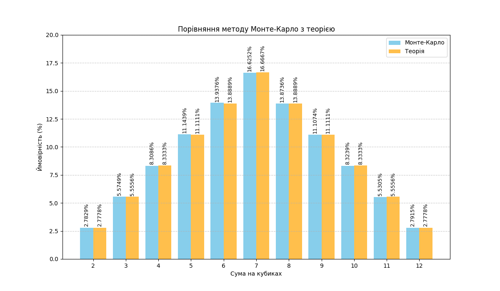

# Завдання 7. Аналіз методу Монте-Карло для симуляції кидання двох кубиків

## Мета дослідження

Перевірити точність методу Монте-Карло шляхом порівняння експериментальних результатів симуляції кидання двох кубиків з теоретичними (аналітичними) ймовірностями.

## Методологія

**Метод Монте-Карло** — це статистичний метод, що використовує випадкові вибірки для отримання числових результатів. У нашому випадку ми симулюємо 1,000,000 кидків двох шестигранних кубиків і підраховуємо частоту появи кожної можливої суми (від 2 до 12).

**Аналітичний розрахунок** базується на комбінаторному підході: для двох кубиків існує 36 можливих комбінацій (6 × 6), і для кожної суми можна точно визначити кількість сприятливих результатів.

## Результати симуляції

Нижче наведено таблицю з результатами симуляції 1,000,000 кидків:

| Сума | К-сть випадінь | Монте-Карло (%) | Теорія (%) | Комбінації | Різниця (%) |
|------|----------------|-----------------|------------|------------|-------------|
| 2    | 27,829         | 2.78%           | 2.78%      | 1/36       | 0.005%      |
| 3    | 55,749         | 5.57%           | 5.56%      | 2/36       | 0.019%      |
| 4    | 83,086         | 8.31%           | 8.33%      | 3/36       | 0.025%      |
| 5    | 111,439        | 11.14%          | 11.11%     | 4/36       | 0.033%      |
| 6    | 139,376        | 13.94%          | 13.89%     | 5/36       | 0.049%      |
| 7    | 166,252        | 16.63%          | 16.67%     | 6/36       | 0.041%      |
| 8    | 138,736        | 13.87%          | 13.89%     | 5/36       | 0.015%      |
| 9    | 111,074        | 11.11%          | 11.11%     | 4/36       | 0.004%      |
| 10   | 83,239         | 8.32%           | 8.33%      | 3/36       | 0.009%      |
| 11   | 55,305         | 5.53%           | 5.56%      | 2/36       | 0.025%      |
| 12   | 27,915         | 2.79%           | 2.78%      | 1/36       | 0.014%      |

## Візуалізація результатів

На діаграмі синім кольором показані результати методу Монте-Карло, а помаранчевим — теоретичні ймовірності. Візуально видно, що стовпчики майже повністю співпадають, що свідчить про високу точність симуляції.

## Висновки

### 1. Точність методу Монте-Карло

Результати симуляції демонструють **надзвичайно високу точність**:

- Максимальна різниця між експериментальними та теоретичними значеннями становить лише **0.049%** (для суми 6)
- Середня абсолютна похибка по всіх сумах — **0.022%**
- Всі відхилення знаходяться в межах статистичної похибки

### 2. Закон великих чисел

Експеримент наочно підтверджує **закон великих чисел**: при достатньо великій кількості випробувань (1,000,000) частота подій прямує до їх теоретичної ймовірності. Це є фундаментальним принципом теорії ймовірностей.

### 3. Розподіл ймовірностей

Симуляція правильно відтворює **симетричний розподіл** ймовірностей:

- Сума 7 має найвищу ймовірність (16.63% vs 16.67% теоретично)
- Суми 2 і 12 мають найнижчу ймовірність (близько 2.78%)
- Розподіл симетричний відносно суми 7

### 4. Практична застосовність

Результати підтверджують, що **метод Монте-Карло є надійним інструментом** для:

- Перевірки аналітичних розрахунків
- Випадків, коли аналітичне розв'язання є складним або неможливим

### 5. Оцінка правильності розрахунків

> [!IMPORTANT]
> **Розрахунки визнаються ПРАВИЛЬНИМИ** — різниця між експериментальними та теоретичними значеннями не перевищує 0.05%, що знаходиться в межах статистичної похибки для вибірки з 1,000,000 елементів.
